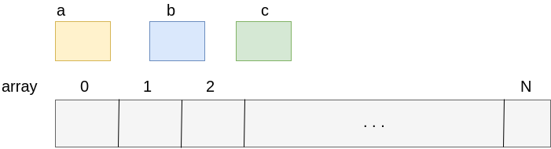
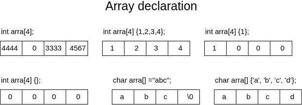
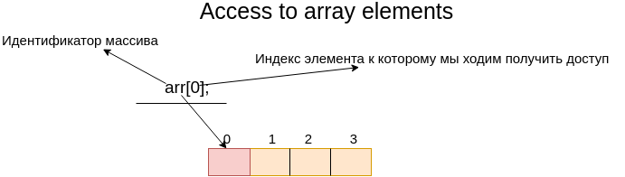
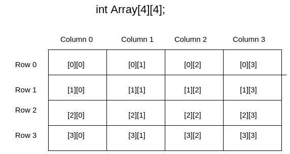
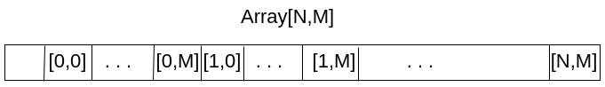

# Описание базовых концептов работы с массивами и указателями
## Массивы
### Массивы основы
Масссив это последовательность элементов фиксированого размера одного и того же типа.
Идея массива заключается в том чтобы вместо обявления, например 10 переменных, можно обявить массив с 10 элементов доступ к которым возможен через единый индитификатор. Другим словом массив это колекция переменных одного типа.


- Массивы нужны когда необходимо хранить большое количество данных 
- Все элементы массива расположенны в памяти последовательно, причем самый нижний адресс массива соответсвует первому элементу, а самый высокий адресс - последнему элементу 
- Элементы массива это самостоятельная единица
- Элементы массива должны быть одного типа
- Каждый элемент массива имеет порядковый номер(индекс)
- Индексация массива начинается с нуля (если размер массива, например 5, то диапазон индексов следующий [0..4])
- Доступ к элементу массива за границей массива есть неопределленное поведение (Undefined Behaviour ISO)
- Все массивы должны быть фиксированого размера (ISO)
- Размер массива всегда должен быть больше нуля(т.е. должен быть не пустой колекцией ISO)

### Работа с массивами
#### Объявление массивов
Объявление массивов имеет следующий вид
```
тип_элементов идентификатор[размер_массива];
```

```cpp
#include <cstdint>
int main() {
  // примеры
  int array[2];
  float array1[3];

  const uint32_t count_element = 5;
  int array2[count_element];

  // не компилируется, т.к. при обьявлении константы в C/C++ ее необходимо инициализировать
  // const int array3[3];

  // не компилируется
  /* const float array_size = 10.5;
   int array_error[array_size];
  */
  

  // компилироваться не будет т.к. не указан размер 
  // double array4[];

  // компилируеться ок, без флага -pedantic
  uint8_t size_runtime = 40;
  uint32_t array3[size_runtime];

  return 0;
}
```

- Согласно стандарту указывать размер массива можно спомощью целочисленного литерала или целочисленной константой значение которой инициализировано литералом ( если обобщить эти все слова то это выражение compile time) и быть **больше нуля**, хотя  есть некоторые рассширяния компиляторов позволяют использовать переменные, но не стоит на них полагаться и следует действовать только в рамках стандарта.
- При обьявление массива, если не выполнять явную инициализицию элементов (как мы делали это в примере с обычными переменными), то содержимое элементов массива является неопределенное значение(содержит муссор).
Массив кроме обычных значений может содержать и константы, работа с ними, также как и работа с обычными константами(инициализация должна быть при объявлении констант).
Простым словом массив можно выразить как понятие контейнера для перемнных с ограничением что эти переменные должны быть одного типа. Нельзя например создать массив в котором будет один элемент `double` второй `int`. Это понятие называеться однородные. 

#### Несколько способов указания размера массива
- Обьявление целочисленной константы спомощью ключевого слова const
```cpp
const size_t array_size = 5;
int array[array_size];
```

- Использовать директиву препроцессора(показываю то что в старом коде такое можете увидеть, но делать так ненадо)
```cpp
#define ARRAY_SIZE 10
int array[ARRAY_SIZE];
```

- Использовать перечесление, тоже некий костыль С подхода (так как в старом С небыло такого понятия как константа)
```cpp
enum {
    ARRAY_SIZE = 5
};

int array[ARRAY_SIZE];
```

Как видно из примеров способов обьявления(указания) размеров много, но рекомендованое использования только через константную переменную. 
#### Инициализация массива
Как было сказано ранее массивы по умолчанию инициализированный неопределенным значение, если инициализирующие значения не указать явно. Инициализирующие значения при обьявление массива могут быть списком инициализации (initializer list), или стровыми литералами (string literal).

```cpp
#include <iostream>

int main() {
  // теперь массив содержит два элемента со значением 1 и 2
  int array[2] = {1, 2};
  // массив с тремя вещественными числами со значением 1.2, 2.5, 3.0
  float array1[3] {1.2, 2.5, 3.0};

  // массив с цетырьмя целочисленными значениями, где каждый элемент проинициализирован нулями
  int array2[4] {};

  // массив с тремя целочисленными значениями, где первый элемент массива проинициализирован 1, а все остальные нулем
  int array3[3] {1};

  // в этом случае компилятор сам опредилит размер массива изходя из списка инициализации
  int  array4[] {1,2,3};

  // в этом случае будет ошибка так как мы явно не указали размер массива,
  // и у нас нет значений в списке инициализации и компилятор не может вывести размер
  // int array[] {} // compiler error

  // инициализация констатного массива, каждый элемент массива только для чтения
  const int array_const[3] {1,2,3};
  /*
   // C initializing style возможно только в С
   int a[10] = { 0,1,2, [5]=25,26, [9]=100}; // {0,1,2,0,25,26,0,0,100,0}
  */
  // немного не ожидаемый вывод)) мы его разберем когда будем рассматривать указатели
  std::cout << array << std::endl;
  // ошибка т.к. инициализирующее выражение должно быть равно или меньше размера массива
  // int array[3] = {1,2,3,4}; // compile error
  return 0;
}
```
Инициализировать константные массивы можно только во время обьявление масива.
В отличие от обычных переменных, которые можно выводить на экран передавая имя переменной в поток вывода, то при передаче имени массива, мы получим не содержимое массива а его адресс.
Если размер массива который указан в квадратных скобочках меньше размера элементов в списке инициализации то мы получим ошибку компиляции

```cpp
// int array[3] = {1,2,3,4}; // compile error
```

В отличие от множества языков программирования, массив не несет в себе информации о своей длине, т.е. по его имени или содержимому мы не можем понять какой длины массив. Все это справедливо, кроме массивов типа char, которые есть исключение с этого правила.

```cpp
#include <iostream>

int main(int argc, char const *argv[]) {
  // размер этого массива 4 элемента, 3 символа + завершающий ноль \0 ( null character)
  char str1[] = "abc";
  // получим ошибку компиляции, что инициализирующее строка массива слищком большая
  // char str2[3] = "abc";
  // размер этого массива 4 элемента, 3 символа + завершающий ноль \0 ( null character)
  char str3[4] = "abc";

  // размер этого массива 20 элемента, 3 первых символа "abc", остальные элементы инициализируються нулем
  char str4[20] = "abc";

  // размер этого массива 3 элемента
  char str5[] = { 'a', 'b', 'c' };
  // размер этого массива 4 элемента, мы явно указали конец строки
  char str6[] = { 'a', 'b', 'c', '\0' };
  // размер этого массива 4 элемента, 3 символа + завершающий ноль \0
  char str7[] = { "abc" };

  // константный массив симолов
  const char str8[] {"const string"};

  std::cout << str7 << std::endl;
  std::cout << str8 << std::endl;

  return 0;
}
```



В символьных массивах символ заверщающего нуля '\0' указывает на конец строки(т.е. зная это можно всегда получить длину массива, т.е. обрабатывать массив пока у вас не символ '\0'). При инициализации символьного массива строковым литералом, и если размер массва указан больше или неуказан явно, компилятор добавляет символ завершающего нуля '\0'. Если мы инициализируем строку списком инициализации символов (str5, str6) компилятор не добавляет специальный символ завершающего нуля.
Символ завершающего нуля очень важен при работе с функциями для работы со строками (которые мы с вами будем рассматривать позже на курсе).
В отличии от обычного массива, размер символьного массива можно узнать используя его содержимое('\0' - нуль терминальный символ).
Также в отличие от обычного массива, символьные массивы можно выводить на экран(используя cout, или функцию `print`) указывая только имя массива.

### Доступ к элементам массива
- Доступ к элементу массива осуществляется с помощью индекса
- Индекс это целочисленное значение(перменная, литерал, константа)
- Нумерация начинается с **нуля** и до размер массива(количество элементов) минус 1
- Выход за границы массива это неопределенное поведение(граница имеется ввиду как нижня так и верхняя)
- Элементы константного массива можно только читать, при попытке что то записать мы получим ошибку компиляции
- Индексом может быть как константное значение, переменная, или выражение


```cpp
#include <iostream>

int main()
{
  // обьявляем массив с четырех элементов
  int array[4] = {1,2,3,4};
  // доступ к элементу который находиться перед первым элементом массива
  // int undefined_value = array[-1];

  // доступ к элементу который находиться после последнего элемента массива [0..3]
  // int undefined_last_value = array[4];
  // считать с памяти значение которое находиться во втором элементе массива
  int arr_first_elem = array[1];
  std::cout << "First element array = " << arr_first_elem << std::endl;

  // записать значение 25 в третий элемент массива {1,2,25,4}
  std::cout << "Third element array = " << array[2] << std::endl;
  array[2] = 25;

  std::cout << "Third after write element array = " << array[2] << std::endl;

  // ошибка компиляции, что неверный тип для индекса массива (double) 
  // int value_array = array[1.35];

  // происходит явное преоразование вещественного в целое(срезка)
  int value_array = array[static_cast<int>(1.35)];

  std::cout << "Second element array = " << value_array << std::endl;
  // обьявляем константный целочисленный массив
  const int read_only_array[2] = {1, 2};

  // прочитать значение которое находится во втором элементе массива
  int const_value = read_only_array[1];
  std::cout << "Second element read only array = " << value_array << std::endl;
  // ошибка компиляции, при записи в read only элемент
  // read_only_array[1] = 3;

  char index = 1;
  int value = read_only_array[index - 1]; // получение первого элемента массива {1}
  return 0;
}

```
### Массивы и циклы
Как было сказано выше простого способа вывода массива на поток нет, то для этого применяют циклы для обхода массивов. Т.е. для того чтобы обработать элементы массива, например посчитать сумму элементов, вывести нечетные элемнты и т.д., вообщем обработать массив как групу элементов.
Пример без цикла, для подсчета суммы элементов, нам пришлось бы писать нечто уродливое.
```cpp
int array[3] = {3,4,5};
int summ += array[0];
summ += array[1];
summ += array[2];

// summ == 12
```

Вместо доступа к каждому элементу массива как в примере выше, используют как раз и цыклы для обработки(обхода) всего массива
- Цыкл for
```cpp
int array[3] = {1,2,3};
// в этом цыкле мы проходимся по массиву array для этого исользуем целочисленный счетчик i
// в начале цикла мы инициализируем счетчик 0, и после каждой итерации проверяем не вышли ли мы за границу массива, если нет то
// увеличчиваем счетчик на 1
for (size_t i = 0; i < 3; ++i) {
  std::cout << array[i] << std::endl;
}

// с с++11 появился новый вид Range-based for loop
for (auto value: array) {
  std::cout << value << std::endl;
}

```
В примере выше два способа for и range-for не являються равнозначными. Но второй являеться безопасным с точки зрения безопастности выхода за границу массива.

- Цыкл while
```cpp
int array[3] = {1,2,3};
// в этом цыкле мы проходимся по массиву array для этого исользуем целочисленный сячетчик i
// вначале мы инициализируем счетчик 0, в цыкле мы проверяем не вышли ли мы за границы массива, если нет то печатаем значение
// элемента и увеличиваем счетчик 
size_t i = 0;
while (i < 3) {
  std::cout << array[i++] << std::endl;
}
```

Обход символьного массива возможен немного другой(в случае если символьный массив заканчивается '\0')
```cpp
char str[] = "abcd";
size_t i = 0;
while (str[i]) {
  std::cout << str[i++] << " ";
}

for (i = 0; str[i]; ++i) {
  std::cout << str[i] << " ";
}

```
Обход массива спомощью цикла `do while` не есть хороший способ, т.к. размер массива должен быть проверен до первого доступа к индексу.

### Размер массива в байтах
Размер массива вычесляется как размер в байтах типа элемента(int(~4), double(~8)) массива умножено на количество элементов
```
sizeof_in_type_byte_array_element * count_array_element
```
```cpp
int value = 10;
std::cout << sizeof(value) << std::endl; // напечатает 4 байта

int array[5] = {2,3,4,5,6};
std::cout << sizeof(array) << std::endl; // напечатает ~20 байта

double array_double[5] = {2.2, 3.2, 4.5, 5.6, 6.8};
std::cout << sizeof(array) << std::endl; // напечатает ~40 байта

```
Стоит быть внимательным, **т.к. размер массива не есть длина массива(количество элементов)!!!!!!** Хотя и это ошибка новичков когда у вас массив символов и размер типа на вашей платформе(компьютере) `char` 1 байт, то мы получим длину массива(количество элементов), и это иногда приводит к заблуждению.

Для того чтобы получить количество элементов массива, необходимо размер массива в байтах разделить на размер элемента в байтах.
```
size_of_all_element_array_in_bytes / sizeof_array_element_in_byte
```

```cpp
int array[5] = {2,3,4,5,6};
// напечатает 5, т.к. sizeof(array) == 20, а sizeof(array[0]) == 4(array[0] это отдельный элемент массива)
std::cout << (sizeof(array) / sizeof(array[0])) << std::endl; 

```
Важно почему берут первый элемент маасива, т.к. по стандарту размер массива не должен быть равен нулю, и поэтому один элемент явно должен присутсвовать, хотя это не верно для расширения компиляторов. Вычесление количество элементов массива необходимо, когда компилятор во время инициализации массива выводит сам размер массива, т.е. мы явно не знаем размер массива

```cpp
int array[] = {2,3,4,5,6}; // компилятор автоматически вывел размер массива 5
size_t count = sizeof(array) / sizeof(array[0]);
for (size_t i = 0; i < count; ++i ) {
  std::cout << array[i] << std::endl;
}
```

### Присвоение массивов
Одним словом присвоить массив как обычную переменную в C++ способа несуществует.
Существует следующая проблема с массива: массивы нельзя присваивать друг-другу даже если они одного типа и размера. Стоит заметить что если попробывать присвоить массивы разных размеров или типов, то получим ошибку несовместимости типов
```cpp
int first_array[3] = {1,2,3};
int second_array[3] = {4,5,6};
 
// first_array = second_array; // compilation error

// first_array = {4,5,6}; // compilation error
// first_array = static_cast<int [3]> ({4,5,6}); // compilation error

int value = 10;
// first_array = value; // compilation error, несовместимые типы int и int[3]
first_array[1] = value; // compile ok
```
Циклы используются также и для присвоедние значений одного массива другому
```cpp
#define SIZE_ARRAY(array) sizeof((array)) / sizeof((array)[0]);

int first_array[3] = {1,2,3};
int second_array[3] = {4,5,6};
size_t count_array_first = sizeof(first_array) / sizeof(first_array[0]);
size_t count_array_second = sizeof(second_array) / sizeof(second_array[0]);

// важно выполнить проверку чтобы размер массива first_array был меньше
// или равен размеру массива second_array. Если этого не сделать то получите перпонения массива
if (count_array_first <= count_array_second) {
  for (size_t i = 0; i < count_array_first; ++i) {
    first_array[i] = second_array[i];
  }
} else {
  std::cout << "Second array size is smaller than size first array" << std::endl;
}

for (size_t i = 0; i < count_array_first; ++i) {
  std::cout << first_array[i] << std::endl;
}

// Массивы  first_array и second_array теперь одинаковы(почти)

```
**Ниже код для тех кто знаком с языком С и\или С++**
Есть еще другие подходы для присвоение массивов это memcpy со стандартной библиотеки и структуры
```cpp
struct Array
{
  int array[3] = {1,2,3};
};
//.....
  Array ar1;
  ar1.array[0] = 10;
  ar1.array[1] = 20;
  ar1.array[2] = 30;
  Array ar2 = ar1;

  for (auto value: ar2.array) {
    std::cout << value << " "; // print 10 20 30
  }
```

### Многомерные массивы
До этого мы рассматривали одномерные массивы(которые имеют одну размерность). В С/C++ можно определять многомерные массивы или другими словами массивы массивов(несколько размеров).
- Количество уровней ограниченно только памятью
- Многомерные массивы в основном представляют ввиде таблиц(например количество строк * столбцов)
- Размерность уровней многомерного массива может быть разная(но в основном используют квадратные таблицы, или другими словами матрицы)
- Основное применение многомерных массивов это графика(матрицы поворота, переноса и т.д.), или классические алгоритмы(например представление ввиде таблицы лабиринта, или таблица смежности для графа)
- Размерность первого уровня может быть опциональным, а для всех остальных должен быть явно задан
- Все правила для работы с одномерным массивом, также относятся и многомерным массивам(присваивание, доступ и т.д.)
- Доступ к элементу массива происходит с указанием индекса для каждого уровня



**Материал для уже немного знакомых с языком С и\или С++**
Выше представлен рисунок как вообщем в удобном виде представляют двумерный массив. Но зная что память это линейная величина, то на самом деле в памяти многомерные массивы представлются немного подругом. Т.е. строки представляются в памяти одна за другой. Например первый размер представлен как N, тогда как другой представлен размером M



Из этого вытекает что любой многомерный массив можно представить одномерным массивом


```cpp
#include <stdio.h>

int main(void) {
  int array[2][2]; // обьявление двумерного массива(содержит неопределенное значение)
  int array1[3][3] = {1,2,3,4,5,6,7,8,9}; // обьявление и инициализация двумерного массива
  int array2[3][3] = {{1,2,3}, {4,5,6}, {7,8,9}}; // другой вид инициализации масиива
  // int array1D[3] = array1[1]; //ошибка компиляции инициализация массива возможна только списком инициализации
  int array3D[3][3][3] = {
                          {{1,2,3}, {4,5,6}, {7,8,9}},
                          {{10,11,12}, {13,14,15}, {16,17,18}},
                          {{19,20,21}, {22,23,24}, {25,26,27}}
                         }; // инициализация двумерного массива

  int array2D[][3] = {{1,2,3}, {1,2,3}, {1,2,3}};

  // ошибка компиляции, можно опускать указание размера первого уровня, но не всех остальных
  // int array2D_error[][] = {{1,2,3}, {1,2,3}, {1,2,3}};

  int value = array1[1][1]; // доступ ко второму элементу первого уровня, и второго элемента второго уровня
  std::cout << "Midle element array1 is " <<  value << std::endl;

  value = array3D[0][1][2];
  std::cout << "Midle element array3D is " << value << std::endl;

  array2[2][2] = 100;

  std::cout << "======= 2D Array =======\n";
  std::cout <<"   Column 1     Column 2    Column 3\n";
  for (size_t i = 0; i < 3; ++i) {
    std::cout <<"Row \t" << i + 1;
    for (size_t j = 0; j < 3; ++j) {
      printf("%5d\t\t", array2[i][j]);
    }
    printf("\n");
  }
  // представление многомерного массива одномерным массивом, см. рисунок выше
  int array1D[3 * 3];
  size_t counter = 0;
  for (size_t i = 0; i < 3; ++i) {
    for(size_t j = 0; j < 3; ++j) {
      array1D[i * 3 + j] = ++counter;
    }
  }
  std::cout <<"====2D array via 1D array====\n"; 
  for (size_t i = 0; i < 3; ++i) {
    for(size_t j = 0; j < 3; ++j) {
      printf("%2d\t", array1D[i * 3 + j]);
    }
    printf("\n");
  }


  return 0;
}
```

## Указатели
### Основные понятия указателя
Укзатель это не что иное как переменная которая хранит адресс(возможно как целое число) памяти где находится значение. Т.е. указатель можно обобщить понятием как целочисленная перменная(number), на разных платформах размер может быть разным, например на 32 битной OS это 4 байта, на 64 битной OS это почти всегда 8 байт. Часто очень путают когда говорят что указатель на int или float, это не совсем верно, тип для указателя это нечто информативное программе сказать сколько байт положить в ячейку памяти расположенном по этому адрессу. 
Указатели можно сравнить в жизненой ситуации, когда например мы знаем номер дома, и мы идем по этому адрессу чтобы например встретится с друзьями или забрать посылку.
Как говорилось в разделе о переменных, то что переменные имеют адресс, для нас в программе это индитификаторы, а для компилятора это адресс по которому надо записать или прочитать значение. Указатель это также отдельная переменная для которой выделяеться память, но в отличие от других переменных, указатель хранит адресс, вместо например вещественного значения и т.д..
Указатель очень важная сущность для управление и работы с памятью. Все что происходит в нашей программе это работа с памятью, когда наша программа выполняется она загружается в память, все инструкции расположенны в памяти и т.д.

В данном уроке мы лишь рассмотрим работу указателей на примере стека
Указатель это косвенная опреация, т.е. для того чтобы прочитать или записать данные в ячейку памяти нужно обратится к адрессу которое записано в переменной указателя и записать туда значение, в отличии от обычных переменных где запись или чтение происходит непосредственно по имени переменной
Стандарт языка C не оговаривает форму представления адресов памяти. Это очень важное замечание, поскольку разные архитектуры могут использовать разные модели адресации. 
### Работа с указателями
#### Объявления указателей
Объявление указателей имеет следующий вид
```
// Указатель обьявляеться как обычная переменная только с добавление звездочки между типом и переменной
// тип * имя_указателя;
```
```cpp
 // обявляеться переменная которая хранит адресс по которому можно читать или писать 4 байта
int *ptr;
```
Как было замечено ранее, тип необходим только компилятору что помнимать сколько в ячейку писать байт и сколько считывать. В правильно понимании указатель обьявляется как нетипизированный
```cpp
void *ptr; // т.е. обьявляется не типизированный указатель
```
Проблема в том чтобы например нам записать что то по этому адрессу или прочитать, нам необходимо преобразовать к конкретному типу.
Стоит отметить что опреция звездочка относиться только первому индетификатору, если обьявлять переменные через запятую

```cpp
// int *ptr, ptr1, ptr2; // т.е. обьявляется указатель ptr, и две целочисленные переменные ptr1 и ptr2
int *ptr, *ptr1, *ptr2; // т.е. обьявляется указатель ptr, и две целочисленные переменные ptr1 и ptr2
// Если мы бы обьявляли указатель как не типизированный, то мы бы получили ошибку компиляции, т.к. нет такого типа void
```
При обявлении указателя, так же как и при обьявлении обычной переменной, этот указатель содержит муссор. И при попытке обратися по этому значению, мы в лучшшм случае получим segmantation fault, т.е попытка обратится к не существующей памяти. По стандарту обращение к неициализированому указателю это UB.
Поэтому указатель при обьявлении инициализируют валидным адрессом или специальным значение null, это означение что в данный момент указатель несодержит адресса другой ячейки памяти. В C++ есть три вида инициализации указателя нулем: 
- макросом NULL
- целочисленным нулем
- специальным значение для указателя nullptr(C++11)
```cpp
int *ptr = NULL;
int *ptr1 = 0;
int *ptr2 = nullptr; // такая инициализация возможна только начиная с C++11
```
Для инициализации указателя адрессом используется символ &. Основной опрерацией для указателя является получение или запись значение которое расположенно по адрессу хранящемся в указателе. Это делается с помощью символа *(да так же само как и при обьявлении указателя), т.е. словами это можно выразить дай или запиши значение которое хранится по этому адрессу. Если у нас непроинициализированный указатель или проинициализирован nullptr то мы получим по стандарту UB (в большей степени это будет segmantation fault). Поэтому перед разыменования указателя его проверяют на nullptr(одним словом это правильный маркер который характеризует невалидность указателя).  Мы можем получить segmantation fault еще если мы попытаемся обратиться к адрессу который не пренадлежит нашему процессу.

```cpp
#include <iostream>

int main(void) {
  int value = 10;
  int *ptr;
  // покажем что каждая переменная имеет свой адресс
  std::cout << "Address value is" << &value << " address ptr is " <<  &ptr << "\n";
  std::cout << "Address where is ptr poineters " <<  ptr << "\n"; // сдесь мы получим муссор
  ptr = 0;
  std::cout << "Address where is ptr poineters " <<  ptr << "\n"; // теперь получим ноль
  ptr = &value; // присвоим указателю адресс пременной
  std::cout << "Address where is ptr poineters " <<  ptr << "\n"; // теперь указатель содержит адресс переменной value
  std::cout << "Address value is " << &value << " address ptr is " <<  &ptr << "\n"; // но адресса переменных все также разнные  
  std::cout << "Value is " << value << " Poinert to address " << ptr << " has the next value " << *ptr << "\n";
  *ptr = 55; // меняе значение которое расположено в переменной value
  // value тоже изменилось
  std::cout << "Value is " << value << " Poinert to address " << ptr << " has the next value " << *ptr << "\n";

  // Работа с не типизированным указателем
  void *ptr_void = nullptr;
  int int_value = 20;

  ptr_void = &int_value;
  std::cout << "Address value is " << &int_value << " address where is pointers " <<  ptr_void << "\n";
  // получим ошибку компиляции т.к. нетипизированный указатель необходимо приводит к типу при получении данных
  // std::cout << "Value " << int_value << " Pointers value " <<  *ptr_void << "\n";
  std::cout << "Value " << int_value << " Pointers value " <<  *((int *)ptr_void) << "\n"; // compile ok, явное приведение типов
  double double_value = 10.4;
  ptr_void = &double_value;
  std::cout << "Address value is " << &double_value << " address where is pointers " <<  ptr_void << "\n";
  std::cout << "Value " << int_value << " Pointers value " <<  *((double *)ptr_void) << "\n"; // compile ok, явное приведение типов
  return 0;
}
``` 
#### Константный указатель и указатель на const
Выше мы расматривали указатели которым можно было менять адресс. В C++ есть такой тип указателя как константный, т.е. указатель адресс которого нельзя менять, адресс указывается при обьявлении указателя. Другой тип указателя это указатель который указывает на константное значение, т.е. сам адресс указателя может меняться, а вот значение по этому адрессу можно только читать но не изменять. Также можно обьявлять константный указатель на константные данные, т.е. значение на которое указывает указатель нельзя изменять и сам указатель нельзя менять.
```cpp
#include <iostream>

int main(void) {
  int value = 20;
  int * const cptr = &value; // константный указатель целочисленное значение
  // int * const cptr_er; // compiler error, константный указатель должен быть проинициализирован при обьявлении
  std::cout << "Address value is " << &value << " address where is pointers " <<  cptr << "\n";
  std::cout << "Value is " << value << " value where pointers cptr " <<  *cptr << "\n";
  *cptr = 40;
  std::cout << "Value is " << value << " value where pointers cptr " <<  *cptr << "\n";
  int value1 = 25;
  // cptr = &value1; // compilation error, адресс на который указывает указатель не должен изменяться 
  *cptr = value1;
  const int *cptr1 = &value1;
  std::cout << "Value is " << value1 << " value where pointers cptr1 " <<  *cptr1 << "\n";
  // *cptr1 = value; // ошибка компиляции, значение на которое указывает указатель есть read-only
  value1 = 40; // но мы может менять оригинальное значение
  std::cout << "Value is " << value1 << " value where pointers cptr1 " <<  *cptr1 << "\n";
  cptr1 = &value; // но сам указатель менять можно, т.е адресс на который он указывает

  const int value2 = 2;
  // ошибка компиляции, т.к. несовместимость типов, указатель указывающий не на const нельзя инициализировать const переменной
  // int *const cptr2 = &value2;
  const int * const cptr3 = &value2;
  // cptr3 = &value1; // compilation error, assignment of read-only variable ‘cptr3’
  // *cptr3 = 55; // compilation error, assignment of read-only location ‘*(const int*)cptr3’
  std::cout << "Value is " << value2 << " value where pointers cptr3 " <<  *cptr3 << "\n";
  return 0;
}
```
```
Output
Value is 20 value where pointers cptr 20
Value is 40 value where pointers cptr 40
Value is 25 value where pointers cptr1 25
Value is 40 value where pointers cptr1 40
Value is 2 value where pointers cptr3 2
```

#### Массивы и  указатели
Что может быть общего между указателями и массивами? Имя массива это фактически указатель на первый элемент массива, фактический всмысле содержит адресс первого элемента. Иногда говорят что имя массива это константный указатель на первый элемент, но я бы сказал что это детали реализации, т.е. это все неявно. Поэтому становиться понятно почему массивы нельзя друг другу присваивать как обычные переменные(но как элементы структуры можно). Ясно одно, и что точно можна сказать что имя массива неявно ковертируеться в укзатель.
Когда мы видим следующую инструкцию
```cpp
array[1] = 1;
```
эта интсрукция на самом деле преобразуется в следующую инструкцию (на асемблерном коде эти две интсрукции генерируют один и тот же код)
```cpp
*(array + 1) = 1;

```
Вопрос почему следующая инструкция коректна в С++
```
int array[3] {1, 2, 3};

1[array] = 25;

```

Массив содержит следующую информацию
- может конвертироваться в адресс на первый элемент массива
- тип элементов массива
- и длина массива

Тогда как указатель содержит следующую информацию
- адресс элемента на который указатель указывает
- тип элемента на который он ссылается

Указатель это массив длиной в один элемент
В С и С++ считаеться валидным вычисления адресса после объекта, т.е. &a[N], где N это количество элементов массива, пока вы не разыменовуваете результирующий указатель. Но вычесление адресса перед объектом считаеться не валидным, т.е. &a[-1], так же как и вычесление вторго элемента после последнего &a[N+1].
На большинстве платформ &a[-1] < &a[0] && &a[N] < &a[N+1], но это возможно не переносимо.

#### Операции с указателями
Кроме рассмотреной выше опрации разыменования указателя, также к указателям применимы следующие опреции
- `!=` сравнивают на неравенство двух указателей (часто используют при сравнении с nullptr)
- `==` сравниваю на равенство два указателя(часто использется при сравнении адрессов в массиве)
- `>=`, `<=`, сравнение указателей, например имеет место при сравнении в стеке адресов, при барьерных решениях

Самая часто применимая операция это `!=`.
```cpp
#include <iostream>
#include <cstdint>
#include <cstdio>
int main() {
  int value1 = 40;
  float value2 = 90;

  std::cout << sizeof(float) << std::endl;
  std::cout << "Address value1 is = " << &value1 << " Address value2 is =" << &value2 << std::endl;
  if ((void *)(&value1) < (void *)(&value2)) {
    std::cout << "value1 address < value2 address " << std::endl;
  }

  if ((&value2) == (&value2)) {
     std::cout << "value2 address == value2 address " << std::endl;
  }

  // приведенные  вышу операции являються неопределенными с точки размещения в памяти
  // но преведенные ниже являбться коректными с точки зения стандарта и размещения в памяти
  int array[2] {1, 2};
  if (&array[0] < &array[1]) {
    std::cout << "&array[0] <  &array[1]" << std::endl;
  }
  return 0;
}
```

#### Арифметика с указателями
Следующий набор арифметических операций может применяться с указателями
- инкремент ++
- декримент --
- опрецации сложения (+, +=)
- опрецации вычитания (-, -=)
- разница между указателями

```
// сложение и вычитание имеет следующую формулу
// количество*sizeof(тип)
```
Т.е. при выполнении арифметики с указателями, мы просто добавляем или вычетаем количество байт связанных с типом указателя.

Также что очень важно любая адрессная арифметика  для (void *) запрещена.

```cpp
int *ptr;
.....
++ptr; // это не значит что мы увеличили указатель на 1, это означает что мы переместили указатель на 4(int) байта вперед
--ptr; // переместили на 4 байта назад
ptr += 4; // переместили указатель 16 байт вперед
```
```cpp
#include <iostream>
#include <сstdlib>


int main(void) {
  int ptr_array[6];
  int *begin = ptr_array;
  const int *const end = ptr_array + 6;
  char counter = 0;
  while (begin != end) {
    *(begin++) = ++counter; 
  }

  void *void_ptr = ptr_array;
  // любая адрессная арифиметика для нетипизированого указателя запрещена
  //++void_ptr;

  return 0;
}
```